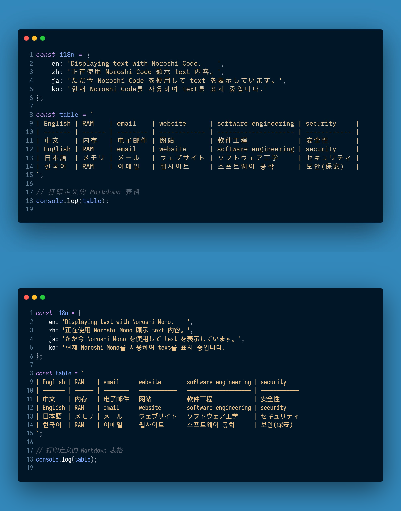

# Noroshi

Noroshi is a monospaced font designed to support CJK (Chinese, Japanese and Korean) characters, derived from the [IBM Plex typeface](https://github.com/IBM/plex).

## Features

Noroshi now includes two distinct families: Noroshi Code and Noroshi Mono, both maintaining a harmonious 1:2 ratio alignment between Western and CJK characters. It is currently undergoing testing and feedback is welcome through issue submissions.

Noroshi Code incorporates characters from IBM Plex Mono and IBM Plex Sans CJK localized versions, adjusting CJK character width to 1200 units to match the 600-unit width of IBM Plex Mono’s Western characters. It features all eight weights from the original IBM Plex series. The Greek alphabets, excluding π, temporarily follow CJK/full-width width in Noroshi Code due to [limited support](https://github.com/IBM/plex/issues/276) of IBM Plex Mono.

Noroshi Mono introduces [Iosevka](https://github.com/be5invis/Iosevka) with a 500-unit width for Western characters, achieving a more compact display. It retains five weights, ensuring visual consistency across Western and CJK.

Both families temporarily have incomplete support for simplified Chinese characters. An update is planned upon the release of IBM Plex Sans SC. Please be aware that the OTF version may display incorrectly in some software. If this occurs, please use the TTF version.

## To build

Noroshi is created with the [Warcraft Font Merger](https://github.com/nowar-fonts/Warcraft-Font-Merger) and the Python libraries fonttools and foundrytools-cli. Python scripts can be found in the [sources/](sources/) directory and may require slight modifications for actual use.

## License

The font files are licensed under the [OFL license](OFL.txt), while the source codes are under the [MIT license](MIT.txt).